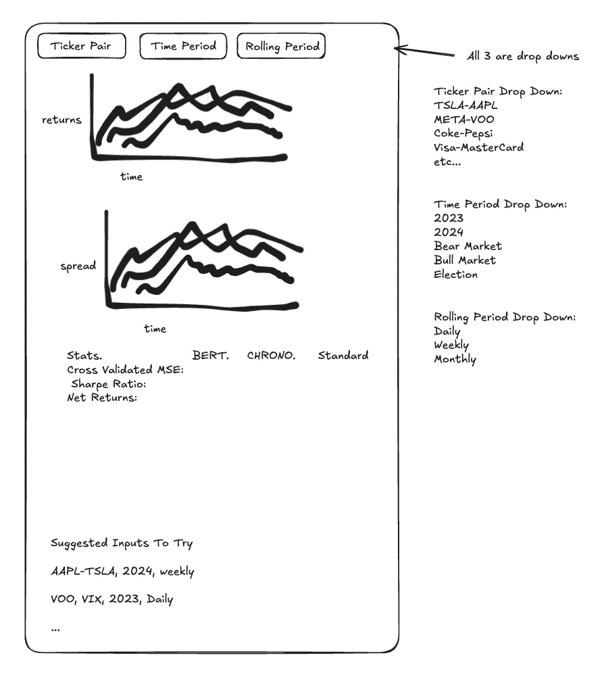

# Research Proposal: Using CHRONOBERT Time Series Forecasting to Utilize Pairs Trading Strategies

**By Caleb Johnson, Casey Hackett, Edgard Cuadra, Shanshan Gong**

---
## Overview of CHRONOBERT
CHRONOBERT is a series of large language models designed for time-sensitive applications, trained exclusively on chronologically ordered, timestamped text to eliminate lookahead bias and training leakage. By preserving the integrity of data during training, CHRONOBERT enables more reliable historical analysis and forecasting, particularly in finance and economics. Despite these constraints, it outperforms standard BERT on language understanding benchmarks such as GLUE, making it a strong candidate for tasks where both performance and chronological consistency are essential. Motivated by these results, we explore whether CHRONOBERT can be adapted to forecast asset price spreads for use in pairs trading strategies.

---

## Bigger Question  
Can methods originally developed for modeling temporally sensitive textual data be effectively adapted for financial time series forecasting?  
More specifically, can a time-insensitive LLM like CHRONOBERT capture relationships in financial asset price movements over time to enhance the performance of systematic trading strategies?

---

## Specific Questions  
- Can CHRONOBERT be used to implement LLM forecasting and pairs trading techniques?  
- How does CHRONOBERT compare when benchmarked against, BERT, which is time-sensitive?  
- How does CHRONOBERT compare to traditional pairs trading forecasting methods?

---

## Hypotheses  
1. CHRONOBERT’s out-of-sample performance will align more closely with its cross-validated results than models without chronological training, indicating lower lookahead bias.
2. Trading strategies based on CHRONOBERT will deliver more stable risk-adjusted returns across unseen market regimes than those using BERT or traditional methods.

---

## Success Metrics  
- Smaller gap between cross-validated and out-of-sample R² and MSE  
- Higher out-of-sample Sharpe Ratio and returns  
- More stable performance across market regimes  
- Benchmarked against BERT and traditional methods


---

## Data Needed  

### Historic Spread Data  
| Date       | Ticker Pair | Spread |
|------------|-------------|--------|
||||
||
||

### Market Return Data  
| Date       | Ticker       | Adjusted Close |
|------------|--------------|----------------|
||
||
||

### Predictions (Future Spreads)  
| Date       | Ticker Pair | Spread | CHRONOBERT Spread | CHRONOBERT Position | BERT Spread | BERT Position | Traditional Method Spread | Traditional Position |
|------------|-------------|--------|-------------------|----------------------|-------------|---------------|----------------------------|----------------------|
||
||
||

---

## Observations  
- **Unit of Observation:** Ticker Pair by Date

---

## Sample Period  
- **Training Period:** Through 2018 (BERT Limit) 
- **Testing Period:** 2023-2024

---

## Sample Conditions  
- Include only ticker pairs with high market cap and liquidity for robust data  
- Limit sample to S&P 500 stocks  
---

## Variables

### Absolutely Necessary  
- Historic spread data for stock pairs  
- Historic stock returns  
- CHRONOBERT predictions  
- BERT predictions  
- Traditional method predictions  
- CHRONOBERT holdings  
- BERT holdings  
- Traditional method holdings  

### Nice to Have  
- Market condition indicators  
- Macro economic indicators (e.g., VIX, interest rates, inflation)

---

## Data Inventory

### Already Have
- Historic spread data  
- Historic return data  

### Need to Generate  
- CHRONOBERT spread and position predictions  
- BERT spread and position predictions  
- Traditional method spread and position predictions  

---

## Data Collection  
- Use `yfinance` or CRSP for market return and spread data  
- Calculate spread manually using historical close prices

---

## Raw Inputs & Storage  

**Folder Structure**  (Up for grabs) 
```
/project/
├── inputs/ (in .gitignore)
│   ├── text files
│   ├── html files
│   ├── zip
├── outputs/
│   ├── returns.csv
│   ├── spreads.csv
│   ├── chronobert.csv
│   ├── bert.csv
│   ├── traditional.csv
├── get_data.ipynb
├── chronobert.ipynb/
├── bert.ipynb
├── traditional.ipynb
├── analysis.ipynb
```

---

## Data Transformation Pipeline (High-Level)  
1. Pull S&P 500 price and return data  
2. Calculate spreads manually from adjusted close 
3. Train CHRONOBERT, BERT, and traditional models on training data  
4. Generate 1-year-ahead spread forecasts  
5. Classify signals (long/short) based on forecast direction/magnitude  
6. Construct portfolios for each model and simulate weekly returns  
7. Evaluate forecasting and trading performance

---

## Final Product

We want to build an interactive dashboard where users can select a ticker pair and time period to view results. The dashboard will display a chart comparing returns across CHRONOBERT, BERT, and traditional methods, as well as a chart comparing the predicted spreads for each method. It will also include a summary of key success metrics such as R², MSE, Sharpe Ratio, and overall returns. This interactive format allows users to directly explore how CHRONOBERT compares to BERT and understand the advantages it brings to pairs trading.


